# ATIN — AI Traffic Intelligence Network
### Flipkart Gridlock 2.0 Hackathon Build

ATIN is a city-scale traffic intelligence platform containing 4 key modules:
1. **Evidence Authenticity Engine (EAS)** — Filters & scores incoming citizen traffic photos using EXIF geo/time tags, OpenCV Laplacian blur checks, and perceptual uniqueness hashes.
2. **Enforcement Priority Engine** — Clusters traffic reports spatially (DBSCAN) and ranks hotspot deployment urgency.
3. **Congestion Prediction Layer** — A LightGBM model trained on spatio-temporal panel datasets predicting future demand/congestion.
4. **City Operations Dashboard** — A live interactive command center with AI-generated patrol deployment narratives.

---

## 🗺️ System Flow Diagram

The following diagram illustrates how a citizen report flows through the four stages of the ATIN system:

```mermaid
graph LR
    classDef startEnd fill:#1A1B26,stroke:#7AA2F7,stroke-width:2px,color:#7AA2F7;
    classDef process fill:#1F2335,stroke:#414868,stroke-width:1px,color:#A9B1D6;
    classDef decision fill:#2A2F41,stroke:#F7768E,stroke-width:2px,color:#F7768E;
    classDef success fill:#1E293B,stroke:#9ECE6A,stroke-width:2px,color:#9ECE6A;
    classDef storage fill:#1F2335,stroke:#BB9AF7,stroke-width:1px,color:#BB9AF7;

    A[Citizen Photo Capture in ASTraM App]:::startEnd --> B[Upload to /api/evidence/validate]:::process
    
    subgraph EAS [Stage 1: Evidence Authenticity Engine]
        B --> C{Image Quality Check}:::decision
        C -- Fails: Blur / Low Details --> D[Instant Citizen Feedback / Reject]:::decision
        C -- Passes: High Edge Complexity --> E[Extract EXIF Metadata]:::process
        
        E --> F{GPS & Time Present?}:::decision
        F -- No --> G[Prompt User for Fallback Location Pin]:::process
        F -- Yes --> H[Compute Authenticity Score]:::process
        G --> H
        
        H --> I{Score >= 60?}:::decision
        I -- No --> J[Reject Submission & Show Score Breakdown]:::decision
        I -- Yes --> K[7-Class Violation Classifier]:::success
    end

    K --> L[Accepted Report & Generated Signal]:::success
    
    subgraph EPE [Stage 2: Enforcement Priority Engine]
        L --> M[Spatial Aggregation & DBSCAN Clustering]:::process
        M --> N[Re-rank City Zones by Severity & Urgency]:::process
    end

    subgraph CPL [Stage 3: Congestion Prediction Layer]
        N --> O[Spatio-Temporal LightGBM Pipeline]:::process
        O --> P[Predict Future Demand & Congestion Spillover]:::process
    end

    subgraph COD [Stage 4: City Operations Dashboard]
        P --> Q[Plot Live Hotspots on Map]:::process
        Q --> R[Generate AI Patrol Narratives]:::process
        R --> S[Expose Smart City APIs]:::storage
    end
```



---


## 🛠️ Project Structure
```text
Codebase/
├── backend/
│   ├── main.py            # FastAPI Application (EAS validation, Hotspots & predictions)
│   ├── ml_pipeline.py     # LightGBM training pipeline with OOF target encoding
│   ├── requirements.txt   # Python backend dependencies
│   └── model/             # Model training metadata & prediction outputs
├── frontend/
│   ├── src/               # React components, leaflet maps, charts & styling
│   ├── index.html         # HTML entry with Leaflet support
│   └── package.json       # Node frontend dependencies
└── README.md              # Instructions to run the application
```

---

## ⚡ Setup & Execution Instructions

Follow these steps to run both services on your local environment:

### Step 1: Start the Backend Server (FastAPI)
Open a new terminal and navigate to the backend directory:
```bash
cd backend
```
Install the Python dependencies:
```bash
pip install -r requirements.txt
```
Run the FastAPI application (served on port `8000`):
```bash
python main.py
```

### Step 2: Start the Frontend Server (Vite + React)
Open a separate terminal window and navigate to the frontend directory:
```bash
cd frontend
```
Install the Node modules:
```bash
npm install
```
Start the development server (served on port `5173`):
```bash
npm run dev
```

### Step 3: Access the Application
Once both services are running:
* **Interactive Dashboard:** Open your browser and navigate to `http://localhost:5173`
* **API Documentation (Swagger):** Open `http://localhost:8000/docs` to test endpoints interactively.

---

## 🧠 Optional: Retraining the LightGBM Pipeline
If you wish to retrain the LightGBM prediction model on the dataset:
1. Ensure the training CSV files (`train.csv`, `test.csv`, and `submission.csv`) are located in the parent directory (`../`).
2. Run the pipeline script from the backend directory:
   ```bash
   python ml_pipeline.py
   ```
3. The trained metrics and predictions will be saved directly inside the `backend/model/` directory and loaded by the API.

---

## 🚀 Cloud Deployment

We have configured the codebase to support deployment on both **Vercel** and **Render**.

### ⚡ Option 1: Deploying with Vercel (Recommended & Free, No Card Required)
Vercel hosts the frontend static files and the Python backend as Serverless Functions, routing them under the same domain automatically.

1. Go to the [Vercel Dashboard](https://vercel.com/) and sign in or create an account.
2. Click **Add New...** and select **Project**.
3. Import your GitHub repository (`Param24-byte/AINT`).
4. Vercel will automatically detect the settings from our root `vercel.json` file.
5. Click **Deploy**. Vercel will build both the React frontend and the FastAPI serverless backend in under 2 minutes.

### 🌐 Option 2: Deploying with Render
*Render offers persistent server instances but requires adding a billing card to your account (even for free services).*

1. Go to the [Render Dashboard](https://dashboard.render.com/) and sign in.
2. Click **New +** and select **Blueprint**.
3. Connect your GitHub repository (`Param24-byte/AINT`).
4. Render will automatically read the `render.yaml` configuration.
5. Click **Apply** to start the automatic deployment.

